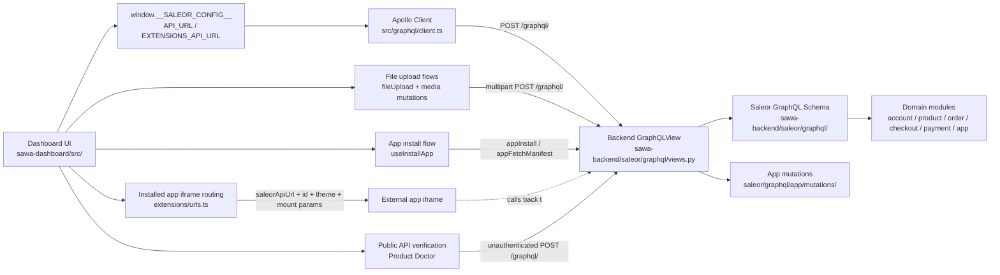
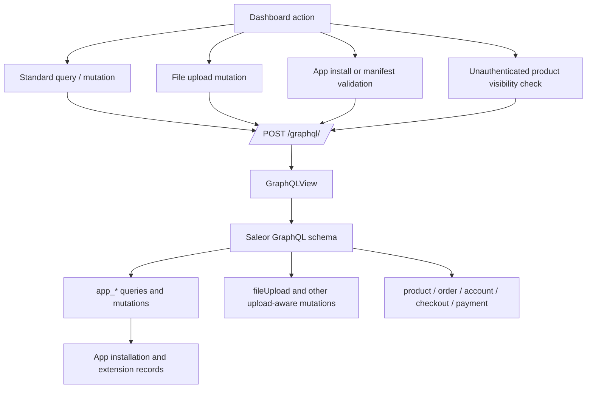

# Dashboard Backend Connection Map

- scope: shared
- purpose: Show how `sawa-dashboard/` connects to `sawa-backend/`, with a visual map of the runtime path and a concrete endpoint catalog.
- read_when: Read before cross-project debugging, GraphQL contract work, app or extension work, or when tracing a frontend action back to a backend handler.
- source_paths: `sawa-dashboard/src/config.ts`, `sawa-dashboard/src/graphql/client.ts`, `sawa-dashboard/src/files/mutations.ts`, `sawa-dashboard/src/extensions/views/InstallCustomExtension/hooks/useInstallApp.ts`, `sawa-dashboard/src/products/components/ProductDoctor/hooks/usePublicApiVerification.ts`, `sawa-dashboard/src/extensions/urls.ts`, `sawa-backend/saleor/urls.py`, `sawa-backend/saleor/graphql/views.py`, `sawa-backend/saleor/graphql/app/schema.py`, `sawa-backend/saleor/graphql/app/mutations/app_fetch_manifest.py`, `sawa-backend/saleor/graphql/app/mutations/app_install.py`
- last_reviewed: 2026-03-14

## Summary

The main runtime contract between the dashboard and the backend is `POST /graphql/`.

- `sawa-dashboard/` reads `window.__SALEOR_CONFIG__.API_URL` in `src/config.ts`.
- `sawa-dashboard/src/graphql/client.ts` sends authenticated GraphQL traffic and multipart uploads to that URL through Apollo `createUploadLink`.
- `sawa-backend/saleor/urls.py` exposes that URL as `^graphql/$`, served by `GraphQLView`.
- App installation and manifest validation also go through GraphQL mutations on the same endpoint.
- The dashboard also constructs iframe context for installed apps using the absolute API URL and app identifiers.

## Runtime Diagram

## Endpoint Diagram

## Endpoint Catalog

| Endpoint | Method | Called from dashboard | Source in dashboard | Backend handler | Details |
| --- | --- | --- | --- | --- | --- |
| `/graphql/` | `POST` | Yes | `sawa-dashboard/src/graphql/client.ts` | `sawa-backend/saleor/urls.py` -> `GraphQLView` | Primary authenticated GraphQL transport for queries and mutations. |
| `/graphql/` | `POST multipart` | Yes | `sawa-dashboard/src/graphql/client.ts`, `sawa-dashboard/src/files/mutations.ts` | `GraphQLView` | Used for `fileUpload` and other upload-aware GraphQL mutations through `createUploadLink`. |
| `/graphql/` | `POST` unauthenticated | Yes | `sawa-dashboard/src/products/components/ProductDoctor/hooks/usePublicApiVerification.ts` | `GraphQLView` | Sends raw GraphQL with `credentials: "omit"` to simulate public API visibility. |
| `/graphql/` | `POST` | Yes | `sawa-dashboard/src/extensions/views/InstallCustomExtension/hooks/useInstallApp.ts` | `saleor/graphql/app/schema.py` -> `AppInstall` | Installs an app by manifest URL through GraphQL mutation `appInstall`. |
| `/graphql/` | `POST` | Yes | dashboard app-management GraphQL layer | `saleor/graphql/app/schema.py` -> `AppFetchManifest` | Fetches and validates an app manifest through GraphQL mutation `appFetchManifest`. |
| external app iframe URL | `GET` iframe navigation | Yes | `sawa-dashboard/src/extensions/urls.ts` | external app, not `sawa-backend` directly | Dashboard passes `saleorApiUrl`, `domain`, `id`, theme, and mount context so the app can call Saleor API itself. |
| `/digital-download/<token>/` | `GET` | Not confirmed from analyzed dashboard files | not confirmed | `sawa-backend/saleor/urls.py` -> `digital_product` | Backend endpoint exposed in the same API surface, but not confirmed as dashboard-called in this analysis pass. |
| `/plugins/channel/<channel_slug>/<plugin_id>/` | webhook endpoint | Not confirmed from analyzed dashboard files | not confirmed | `handle_plugin_per_channel_webhook` | Backend plugin webhook surface; exposed alongside GraphQL but not confirmed as dashboard-called. |
| `/plugins/global/<plugin_id>/` | webhook endpoint | Not confirmed from analyzed dashboard files | not confirmed | `handle_global_plugin_webhook` | Backend plugin webhook surface. |
| `/plugins/<plugin_id>/` | webhook endpoint | Not confirmed from analyzed dashboard files | not confirmed | `handle_plugin_webhook` | Backend plugin webhook surface. |
| `/thumbnail/<instance_id>/<size>/<format?>` | `GET` | Not confirmed from analyzed dashboard files | not confirmed | `handle_thumbnail` | Backend image-thumbnail endpoint exposed by API service. |
| `/.well-known/jwks.json` | `GET` | Not confirmed from analyzed dashboard files | not confirmed | `jwks` | Backend key-discovery endpoint exposed by API service. |

## Dashboard Entry Points

- `sawa-dashboard/src/config.ts`
  - `getApiUrl()` reads `window.__SALEOR_CONFIG__.API_URL`.
  - `getAbsoluteApiUrl()` resolves relative GraphQL URLs against the dashboard origin.
  - `getExtensionsConfig()` reads `window.__SALEOR_CONFIG__.EXTENSIONS_API_URL`.

- `sawa-dashboard/src/graphql/client.ts`
  - `apolloClient` uses `createUploadLink({ uri: getApiUrl(), credentials: "include" })`.
  - `saleorClient` also points to `getApiUrl()`.
  - This makes the backend GraphQL endpoint the single transport for normal mutations, queries, and uploads.

- `sawa-dashboard/src/extensions/views/InstallCustomExtension/hooks/useInstallApp.ts`
  - Sends `appInstall` with `appName`, `manifestUrl`, and permission codes.

- `sawa-dashboard/src/files/mutations.ts`
  - Defines `FileUpload` mutation, which still rides through the same GraphQL endpoint.

- `sawa-dashboard/src/products/components/ProductDoctor/hooks/usePublicApiVerification.ts`
  - Uses direct `fetch(getAbsoluteApiUrl())` instead of Apollo.
  - Explicitly omits credentials to test public visibility rules.

- `sawa-dashboard/src/extensions/urls.ts`
  - Builds iframe URLs for installed apps.
  - Passes `saleorApiUrl`, `domain`, `id`, and mount-specific query parameters into the app URL.

## Backend Handling Path

- `sawa-backend/saleor/urls.py`
  - Declares `^graphql/$` as the API route.
  - Also exposes plugin, thumbnail, digital-download, and JWKS endpoints.

- `sawa-backend/saleor/graphql/views.py`
  - `GraphQLView` handles:
    - `POST` query execution
    - file upload support
    - query batching
    - optional GET playground when enabled

- `sawa-backend/saleor/graphql/app/schema.py`
  - Exposes app-related queries and mutations, including:
    - `app_install`
    - `app_fetch_manifest`
    - app listing and extension queries

- `sawa-backend/saleor/graphql/app/mutations/app_fetch_manifest.py`
  - Validates manifest URLs, fetches remote manifest JSON, normalizes permissions, and returns a typed `Manifest`.

- `sawa-backend/saleor/graphql/app/mutations/app_install.py`
  - Validates install input, resolves permissions, creates installation records, and schedules install task execution.

## Practical Trace Paths

### 1. Standard dashboard data flow

1. UI action triggers generated GraphQL hook or Apollo request.
2. `apolloClient` sends request to `getApiUrl()`.
3. Backend `GraphQLView` parses and executes against Saleor schema.
4. Domain resolver or mutation in `saleor/graphql/*` returns result.
5. Dashboard updates UI from GraphQL payload.

### 2. File upload flow

1. Dashboard triggers `fileUpload` or another upload-aware mutation.
2. Apollo `createUploadLink` serializes multipart request to `/graphql/`.
3. Backend `GraphQLView` accepts upload-capable GraphQL request.
4. Mutation returns uploaded file URL or upload errors.

### 3. App install flow

1. Dashboard install form calls `useInstallApp`.
2. `appInstall` mutation is posted to `/graphql/`.
3. Backend `AppInstall` validates permissions and manifest URL.
4. Backend creates installation record and queues install task.
5. Dashboard tracks installation state through app-installation data.

### 4. Public product visibility check

1. Product Doctor builds raw GraphQL query string.
2. Dashboard posts directly to absolute API URL with no credentials.
3. Backend resolves query as unauthenticated request.
4. Dashboard compares returned product data with internal admin view.

## Notes

- This map is based on confirmed source files only.
- The primary confirmed integration endpoint is still `/graphql/`; many distinct features are specialized behaviors on top of that single transport.
- Plugin, thumbnail, download, and JWKS endpoints are confirmed backend surfaces, but this analysis pass did not confirm direct calls to them from analyzed dashboard source paths.
